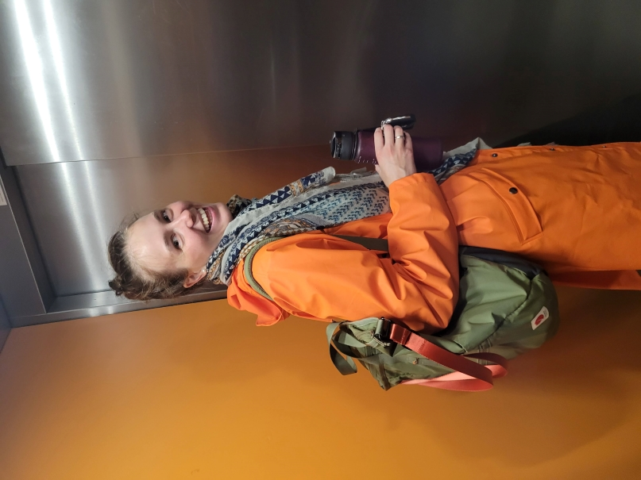

<h3>Hi! I am a Data Analyst / Data Scientist* with a strong mathematical background. Welcome to my GitHub page!</h3>

> I used to do my research on time series analysis in a lab, but then I realized I prefer to see my results applied on practice straight away, so I switched to business tasks.

> I still believe mathematical research is very important. That's why I admire how things are moving now in Data Science - when you have a mathematical model developed for a very practical purpose.

> My major area of interest is Deep Learning and Computer Vision. That's where I worked for the past 5 years. I completed several interesting projects with manufacturing images analysis, visual changes of objects over time, video generation. But I also enjoy working with huge tabular data, all the exploration stuff, data preparation, understanding which business problems are possible to solve with the data available. I believe that often the simplest models give you the best overview of what's going on. Plus, if it's possible to get rid of the blackbox model in the end and make it interpretable, I always prefer doing that.

<h4>So I am here, solving business tasks with my maths!</h4>

\* **<i>If you have a project in mind, do not hesitate to contact me!</i>**

***

This webpage presents a professional side of mine. I come here as a mathematician, data analyst and data scientist and a bit of developer and researcher. I was sure I'll never be able to keep a professional blog, but I started one (and it only has two entries still <i class="fa-regular fa-face-laugh-beam"></i>). I also needed a page to put my CV to, and I here have one. I plan to have some of my services presented to you on this page in the future. But life's too much fun and goes too fast, so by far if you are interested in working with me or doing some projects, just drop me an email.

And yes, this page suits the most to host my ~~serious~~ photo! <i class="fa-regular fa-star"></i> (reminder: it's never too late to stop being serious!)

***

Project maintained by [hannarud](https://github.com/hannarud)
